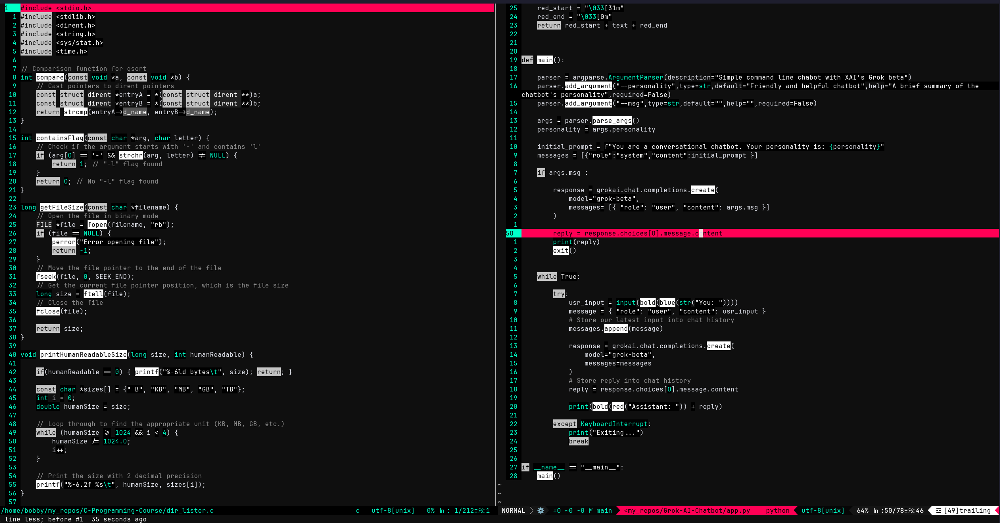

# Gothic-Cyberpunk Theme
Vim colorscheme | A minimalistic gothic theme


## Installation

You can install gothic-cyberpunk via plug adding to your `.vimrc` or `init.vim`:

```
Plug 'bobby-valenzuela/gothic-cyberpunk.vim'
```

Or manually copying:

- (vim)    `colors` -> `~/.vim/colors`
- (neovim) `colors` -> `~/.config/nvim/colors`

<br />

## Settings
Lua
```lua
vim.opt.termguicolors = true

-- Set background to dark
vim.opt.background = 'dark'

-- Enable cursorline highlighting
vim.opt.cursorline = true

-- Hide status in cmdline since it will showin airline
vim.opt.showmode = false

-- Set color scheme
vim.cmd.colorscheme 'gothic-cyberpunk'

-- Set airline theme settings
vim.g.airline_theme = 'lucius'
vim.g.airline_powerline_fonts = 1
vim.g.airline_left_sep = ''
vim.g.airline_left_alt_sep = ''
vim.g.airline_right_sep = ''
vim.g.airline_right_alt_sep = ''
```
<br />

Vimscript  
```vimscript
set termguicolors

" Set background to dark
set background=dark

" Enable cursorline highlighting
set cursorline

" Hide status in cmdline since it will show in airline
set noshowmode

" Set color scheme
colorscheme gothic-cyberpunk

" Set airline theme settings
let g:airline_theme='lucius'
let g:airline_powerline_fonts=1
let g:airline_left_sep=''
let g:airline_left_alt_sep=''
let g:airline_right_sep=''
let g:airline_right_alt_sep=''
```

## Screenshots

---
